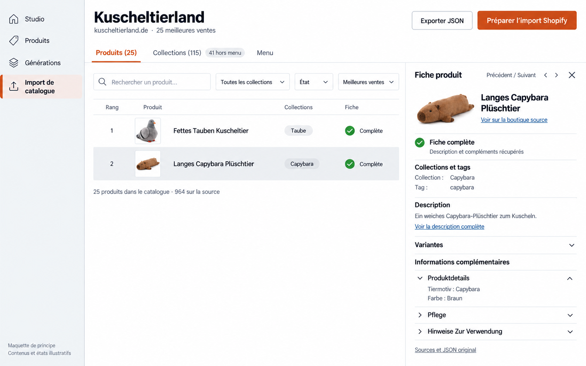

> Mise à jour du 1er octobre 2026 : implémentation autorisée dans la conversation suivante. « Reprendre là où ça a fail » remplace le redémarrage destructif ; « supprime tout » autorise le retrait des anciennes données catalogue **dev uniquement**. Voir [transition](catalog-workspace-migration.md) et [qualification](catalog-refonte-qualification.md). Le cadrage historique ci-dessous est conservé.

# Import de catalogue — proposition d’interface

Date : 29 septembre 2026. Mise à jour : 30 septembre 2026, ajout de la maquette V2 fournie par l’utilisateur. **Cadrage et référence visuelle, sans implémentation.**

Références : [attendus](catalog-refonte-attendus.md), [UML](catalog-refonte-uml.md), [vérifications préalables](catalog-refonte-verification-prealable.md), `PRODUCT.md` et composants actuels de `app/features/catalog-import`.

## Intention

Permettre à un marchand de récupérer la structure d’une boutique publique, contrôler son contenu, puis télécharger le catalogue ou l’importer dans sa boutique Shopify. L’action centrale est **contrôler le catalogue avant de lancer l’import**.

Trois étapes visibles : **Source → Tags → Catalogue**. Le traitement collection par collection apparaît dans la progression ; il ne dicte pas l’ordre de consultation des produits.

Conception du parcours complet, avec schémas fonctionnels et spécification des comportements. Aucun prototype interactif ni composant livré. Après les échecs de génération dans cette session, l’utilisateur a fourni la maquette V2 ci-dessous et demandé son intégration au cadrage.

## Maquette de référence — V2



[Ouvrir l’image originale](../output/catalog-refonte-interface-v2.png). Pièce jointe du 30 septembre 2026, conservée à l’identique dans le dépôt ; aucun lien vers un fichier temporaire n’est nécessaire.

Cette maquette représente l’onglet **Produits** avec une fiche ouverte. Les contenus, tags et états de réussite sont illustratifs ; elle ne démontre ni une collecte Top 25 complète ni un import réel. Les autres étapes et états restent décrits dans ce document. Son ajout ne constitue pas une autorisation de commencer l’implémentation ou d’écrire dans Shopify.

Principes représentés :

- Trois onglets **Produits / Collections / Menu**, indicateur neutre **41 hors menu** près de Collections, sans grand bandeau dans la liste Produits.
- Tableau sans cases de sélection inutiles ; la ligne grisée identifie uniquement la fiche ouverte. Pied de liste : **25 produits dans le catalogue · 964 sur la source**.
- Action principale **Préparer l’import Shopify**, qui ouvre le choix de destination et le récapitulatif avant toute confirmation.
- Fiche latérale avec photo compacte, lien source, navigation précédent/suivant, collections et tags visibles, aperçu de description et compléments HTML accessibles.
- Une synthèse **Fiche complète — Description et compléments récupérés** ; détails de lecture et JSON intégral sous **Sources et JSON original**.

La maquette guide la composition, sans imposer chaque détail du rendu généré : garder le titre compact, un seul chevron par accordéon et des contrôles accessibles. Les exemples allemands ne remplacent jamais les données réellement collectées.

## Direction visuelle

Le marchand travaille sur ordinateur, dans une pièce éclairée, et compare de nombreuses fiches avant une opération importante. Garder le thème clair existant pour les exemples et respecter le thème sombre choisi dans l’application.

- Conserver la navigation générale et l’entrée **Import de catalogue**.
- Réutiliser Geist, les surfaces neutres, séparateurs fins et l’orange existants. Une seule action principale colorée par contexte ; aucun ajout d’ombres.
- Tableaux lisibles, petites miniatures produit, titres allemands conservés, interface française.
- Références d’interaction : Shopify Admin pour les listes métier, Linear pour la densité et l’inspecteur latéral, composants actuels de l’application pour la cohérence visuelle.
- Pas de grille de statistiques, de journal technique permanent ou de paramètres Convex/R2 dans le parcours.

Deux structures ont été envisagées : A, catalogue central avec onglets et inspecteur ; B, navigation permanente par collection. **Recommandation A** : classement global plus naturel, produits partagés visibles une seule fois, accès aux collections par filtre. B reste utile comme vue filtrée d’une collection, sans deuxième navigation permanente.

## 1. Choisir la source

Une page simple, formulaire en premier, catalogues précédents en dessous.

```text
Import de catalogue
Récupérez le menu, les collections et les produits d’une boutique.

Boutique source
[ https://www.kuscheltierland.de                         ]

Produits à récupérer
( ) Tout le catalogue
(●) Les meilleures ventes     Nombre de produits [ 25 ]

Le menu et toutes les collections sont conservés dans les deux modes.

                                           [ Analyser la boutique ]

Catalogues précédents
Boutique                 Sélection           État           Modifié le
…
```

- Aucun mode sélectionné implicitement par une ancienne opération. Pour une nouvelle entrée, proposer « Tout le catalogue » par défaut ; l’exemple montre le choix volontaire Top 25.
- N est un entier strictement positif, validé avant l’analyse. Si N dépasse le nombre disponible, annoncer le nombre réellement sélectionné, sans inventer de produits.
- La boutique de destination est choisie à l’import : elle n’est pas requise pour collecter ou exporter un JSON.
- Pendant la découverte : afficher l’étape réelle (« Lecture du menu », « Recherche des collections », « Classement des produits », « Vérification des appartenances »). Les nombres inconnus restent « En cours », jamais zéro par défaut.
- Si l’analyse est incomplète, distinguer les collections recensées des appartenances encore inconnues. Aucune promesse de couverture totale.
- L’historique ouvre le catalogue et son état courant. Les opérations de l’ancien moteur restent identifiables et ne sont pas converties implicitement.

## 2. Valider les tags des collections

```text
Kuscheltierland                                  Source ✓  /  Tags  /  Catalogue
25 meilleures ventes sélectionnées · 115 collections

Validez les tags proposés
Chaque collection sera créée avec une règle fondée sur son tag.

[ Rechercher une collection ] [ Toutes ▾ ]

□  Collection       Tag proposé          Dans la sélection      Menu
□  Capybara         [ capybara       ]   1 produit               Présente
□  Otter            [ otter          ]   0 produit               Présente
□  Hirsch           [ deer           ]   0 produit               Hors menu

[ Valider la sélection ]                         [ Valider et collecter ]
```

Tags montrés ci-dessus : propositions illustratives, pas résultat d’un appel IA. Noms, couverture et intersections Top 25 issus du relevé réel pour ces trois collections.

- Un tag anglais distinct par collection, modifiable dans la ligne. Les noms et le contenu source gardent leur langue.
- États explicites : « À valider », « Validé », « À corriger ». Une modification après validation remet le tag concerné à valider.
- L’IA propose ; aucun clic sur « Analyser » ne vaut validation des tags.
- Actions groupées possibles, mais toujours explicites. Une sélection couvrant plusieurs pages indique son périmètre exact.
- « Valider et collecter » valide explicitement les propositions restantes et lance la collecte après contrôle. Tags vides ou collisions : erreurs dans les lignes concernées, action indisponible avec explication. Pas de règles ET/OU à configurer.
- Les collections vides et hors menu participent à la validation comme les autres.
- En cas d’échec de proposition IA, saisie manuelle possible ; relancer l’IA ne remplace pas les corrections déjà saisies.

## 3. Contrôler le catalogue

Un espace principal avec **Produits**, **Collections**, **Menu**. La collecte, les erreurs et les résultats d’import sont des états de cet espace, sans onglets techniques supplémentaires.

```text
Kuscheltierland                     [ Exporter JSON ] [ Préparer l’import Shopify ]
kuscheltierland.de · 25 meilleures ventes

Produits (25)      Collections (115) · 41 hors menu      Menu
───────────────────────────────────────────────────────────────────────────────────

[ Rechercher un produit ] [ Collection ▾ ] [ État ▾ ] [ Meilleures ventes ▾ ]

Rang  Produit                                      Collections      Fiche
1     Fettes Tauben Kuscheltier flauschiger Vogel    …                …
2     Langes Capybara Plüschtier Schlafkissen        Capybara         …

25 produits dans le catalogue · 964 sur la source
```

Le schéma illustre l’organisation ; il ne représente pas une collecte Top 25 déjà exécutée. Les totaux de 964 produits, 115 collections et 41 hors menu sont mesurés. Aucun total de collections vides n’a été mesuré.

### Produits

- Tri initial « Meilleures ventes », rang source visible, date de lecture accessible. Autres tris : nom et état. Les rangs inconnus sont explicitement non classés ; aucun volume de ventes affiché.
- Filtres collection et état, recherche textuelle, pagination. Les produits sans collection restent dans la liste globale et sont filtrables.
- Une ligne par identité produit, même avec plusieurs collections. Les appartenances multiples restent consultables. Pas de cases à cocher sans action groupée définie ; la surbrillance indique seulement la fiche ouverte.
- Un clic ouvre une fiche latérale, garde le filtre et la position de lecture ; navigation précédent/suivant dans les résultats filtrés.
- La fiche expose une image compacte et un lien source, les collections/tags, un aperçu de description, les variantes et les **informations complémentaires du HTML**. Conserver les rubriques source, notamment Pflege, Produktdetails et Hinweise Zur Verwendung. Ouvrir Produktdetails par défaut lorsqu’elle existe, avec des accordéons simples et un seul chevron par rubrique.
- Synthèse de réussite unique : « Fiche complète — Description et compléments récupérés ». Les statuts JSON et HTML restent distincts dans les détails de sources. La présence du JSON ne suffit pas à afficher « Complète » : une erreur HTML reste visible au premier plan (« Compléments HTML manquants — Relancer »). Un HTML lu sans complément extrait est signalé comme tel, sans prétendre qu’aucun complément n’existe sur tout thème.
- JSON intégral accessible via une section secondaire « Sources et JSON original », lisible et copiable. Ne pas l’imposer pour examiner une fiche.
- Conserver l’accès aux corrections manuelles existantes ; validation explicite des modifications, retour à la valeur source disponible. Aucun enrichissement ou remplacement SEO automatique.

### Collections

Tableau : **Collection / Tag / Produits dans le catalogue / Produits sur la source / Menu / État / Action**.

- Filtres « Toutes », « Vides dans ce catalogue », « Hors menu », « À relancer ».
- Les comptes source sont affichés seulement si les appartenances sont connues. « Non vérifié » remplace tout faux zéro.
- Capybara : 1 sélectionné sur 40 ; Otter : 0 sur 12 ; Hirsch : 0 sur 2 et « Hors menu » — exemples réellement observés.
- Collection vide à cause du Top N : « Aucun produit parmi les 25 meilleures ventes. La collection sera conservée. » Ce n’est pas une erreur.
- Bouton « Ajouter les produits manquants ». Dans le détail, préciser le nombre quand il est établi et l’absence de doublons. Les produits partagés déjà présents ne sont pas récupérés une deuxième fois.
- Avant ajout, annoncer : « Ces produits s’ajouteront à votre sélection initiale. Le catalogue pourra dépasser 25 produits. » Après ajout, sous-titre « Top 25 + X produits ajoutés », avec X distinct et réel.
- Un clic sur le nombre ouvre l’onglet Produits filtré sur cette collection ; retour simple à Collections.
- L’état de récupération des membres et celui des fiches sont distincts : une collection non vérifiée ne peut être déclarée vide.

### Menu

- Arbre dépliable, hiérarchie et libellés source, uniquement liens collections. Parents nécessaires sans lien représentés comme regroupements.
- Collections absentes présentées dans une liste séparée sous l’arbre, avec filtre/recherche si nécessaire ; elles ne sont pas ajoutées automatiquement au menu.
- Une collection vide reste une destination valide. Ne pas barrer son lien ou la supprimer.
- « Voir la collection » ouvre le détail correspondant. Pas d’éditeur complet de thème ou de navigation ajouté au périmètre.

## Progression et échecs

Pendant la collecte, une bande de progression apparaît au-dessus des onglets : collection en cours, produits uniques réussis / prévus, échecs, temps écoulé. Exemple de libellé sans mesure fictive : « Collecte de Capybara · Informations produit et compléments HTML ».

- Les collections vides peuvent être marquées « Aucun produit sélectionné ». Les produits déjà récupérés via une autre collection comptent une seule fois.
- Aucun nombre de tâches techniques, de checkpoints ou de fichiers affiché. Pas d’estimation de durée sans base mesurée.
- Les fiches déjà disponibles restent consultables. Le navigateur peut être fermé ; rouvrir le catalogue restitue son état serveur.
- Un bandeau de résultat partiel indique les quantités réelles et propose « Voir les produits concernés » et « Relancer les produits en échec ».
- Erreurs de découverte : relance de la phase correspondante ; erreurs produit : relance des seuls produits concernés. Les réussites restent conservées.
- Ralentissement temporaire : message « La boutique demande de ralentir. Nouvelle tentative en cours. » Blocage 403/challenge : « La boutique bloque la lecture », sans prétendre qu’une simple attente suffira.
- « Tout recommencer » est dans le menu secondaire. Confirmation avec nom du catalogue et avertissement : les données et corrections de cette tentative seront supprimées ; les objets Shopify déjà créés ne seront pas supprimés.
- Pas de nouvelle mécanique pause/reprise promise par l’interface de refonte. L’état récupérable et la relance suffisent au contrat actuel ; les fonctions du moteur existant restent intactes.

## Export JSON

- « Exporter JSON » produit le fichier à partir du catalogue courant. État « Génération du fichier », puis « Télécharger le JSON ».
- Un changement de données rend le fichier précédent obsolète : bouton « Régénérer le JSON ». Un ancien fichier n’est jamais présenté comme courant.
- Un échec de génération permet de relancer cette génération, sans relancer la collecte.
- Si le catalogue est partiel, afficher avant lancement les manques concrets et demander l’acceptation du caractère partiel.
- Le JSON conserve données disponibles et états d’incomplétude ; aucune fiche JSON seule présentée comme complète. L’export est autorisé une fois les travaux actifs terminés, pour produire un état stable.

## Import Shopify

Depuis « Préparer l’import Shopify », ouvrir un panneau de préparation et de confirmation, suffisamment large pour lire le récapitulatif. Le catalogue reste visible derrière. Ce premier bouton ne lance aucune écriture dans Shopify.

1. **Boutique de destination**, nom et domaine explicites, parmi les boutiques autorisées.
2. **Contenu** : collections y compris vides, produits admissibles, fiches incomplètes/exclues et menu. Les quantités création/existant restent « À vérifier » jusqu’à une vérification réelle.
3. **Effets** : créations en brouillon ; réutilisation des identités déjà importées et conservation des tags manuels ; collections automatiques par tags ; menu séparé non affecté au thème ; aucune publication automatique.
4. **Catalogue partiel**, si nécessaire : détails des exclusions et case explicite « J’accepte d’importer ce catalogue incomplet ».
5. Bouton **« Confirmer l’import »** avec destination rappelée à proximité.

Pour la première version proposée, seules les fiches complètes sont soumises à Shopify ; les fiches à HTML manquant restent conservées et inspectables dans le catalogue/export, mais sont explicitement exclues de cette soumission. Cela permet un import partiel sans transformer silencieusement une fiche incomplète en fiche finale. Une collecte/relance active doit se terminer avant confirmation.

Pendant l’import : lecture du catalogue autorisée, modifications/ajouts/redémarrage temporairement indisponibles avec raison visible. Afficher des phases métier : **Collections → Produits et images → Liens et menu**. Les attentes Shopify sont distinguées des erreurs : « Shopify prépare les images » ou « Vérification de la soumission en cours ». Une soumission incertaine ne propose jamais « Recréer les produits » tant que sa situation n’est pas réconciliée.

Résultat : nombres effectivement créés, retrouvés, réussis et en échec sans doubles comptes ; accès aux objets Shopify autorisés ; état du menu et des collections ; rappel « Produits créés en brouillon. Menu non affecté au thème. » Relancer uniquement ce qui nécessite une intervention, après réconciliation.

Le classement de la source est consultable/exporté. Le tri meilleures ventes de la boutique destination dépend de ses propres ventes ; aucune reproduction automatique de ce classement n’est promise.

Cette définition d’interface n’autorise aucun import réel.

## Responsive, accessibilité et interactions

- Desktop : tableau principal et fiche latérale ; en largeur réduite, la fiche occupe tout l’espace disponible avec retour à la liste.
- Mobile : navigation générale repliée, onglets conservés, filtres dans un panneau, ligne produit compacte avec rang, nom et état. Les détails secondaires se lisent dans la fiche. Actions principales accessibles sans défilement horizontal de toute la page.
- Tableaux sémantiques sur desktop ; titres, tags et noms longs peuvent se replier. Le menu est un arbre utilisable au clavier, avec état déplié annoncé.
- Libellés persistants, focus visible, contrastes WCAG AA, erreurs liées aux champs. Aucun état distingué par la couleur seule.
- Compteurs et progression annoncés avec modération aux lecteurs d’écran. Fermeture du panneau rend le focus à la ligne ou au bouton d’origine.
- Transitions discrètes de 150–200 ms, mouvement réduit respecté ; aucun contenu caché derrière une animation d’apparition.
- Sauvegarde explicite des éditions ; aucun remplacement automatique d’une saisie par une actualisation serveur. Échec d’enregistrement visible et contenu saisi conservé.

## Critères à vérifier lors de l’implémentation

1. Le marchand peut lancer le catalogue complet ou un Top N sans connaître l’architecture backend.
2. Aucun tag IA n’est appliqué avant une validation humaine explicite ; collisions identifiées avant collecte.
3. La liste globale conserve un produit unique et son rang source, même dans plusieurs collections.
4. Une collection vide dans Top N, une collection inconnue et une collection en échec sont visuellement distinctes.
5. Les collections hors menu sont faciles à retrouver et ne sont jamais ajoutées au menu implicitement.
6. Une fiche JSON réussie mais HTML en échec n’est jamais annoncée complète.
7. Les ajouts manuels au-delà de N sont compréhensibles et ne doublonnent pas les fiches.
8. Les confirmations export/import présentent précisément ce qui manque ; les effets sur la boutique sont compréhensibles avant import.
9. Revenir sur le catalogue conserve sa progression ; les actions de relance ne font pas perdre les réussites ou corrections.
10. Clavier, mobile, thèmes clair/sombre et titres longs sont vérifiés sur les vrais composants au moment du développement.

Pour l’implémentation, appliquer les références Impeccable `product.md`, `layout.md`, `clarify.md` et `harden.md` aux composants existants. Ce document ne constitue pas une validation navigateur, une qualification de performance ou un import de bout en bout.

## Décision attendue

La maquette V2 fournie par l’utilisateur est désormais la référence visuelle de l’espace catalogue. Le parcours complet **Source → Tags → Catalogue**, les états et les comportements restent cadrés ci-dessus ; les écrans absents de l’image ne sont pas considérés comme validés visuellement. Le code de la refonte ne commence pas dans cette étape de conception.
