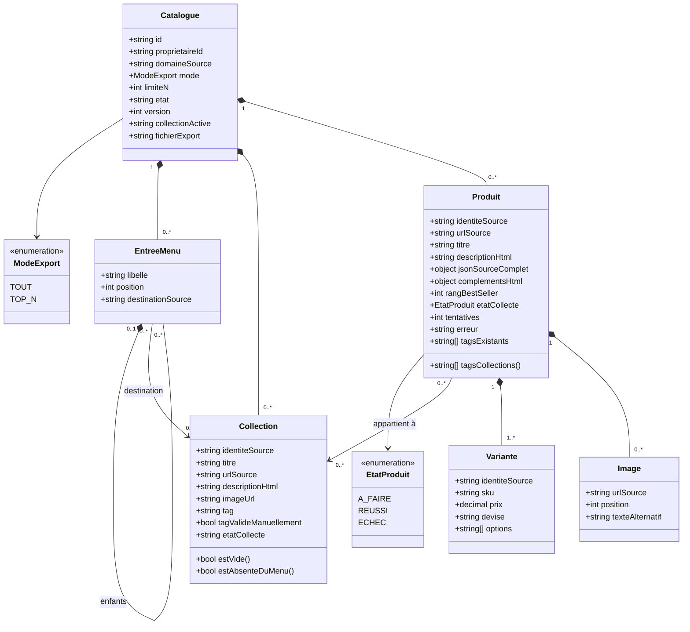
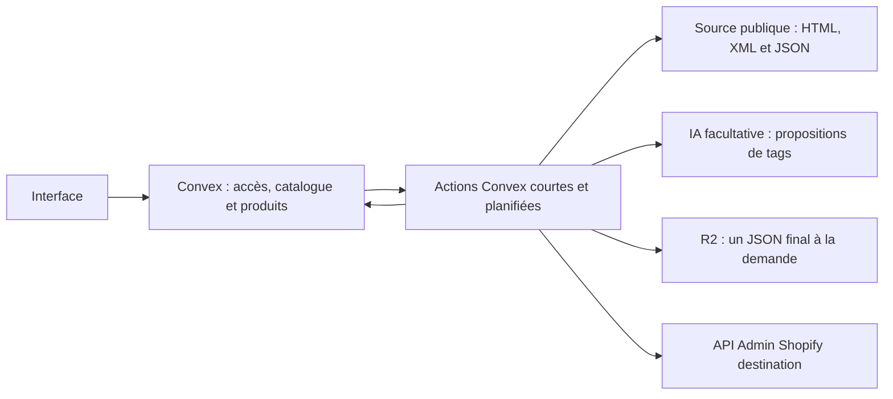
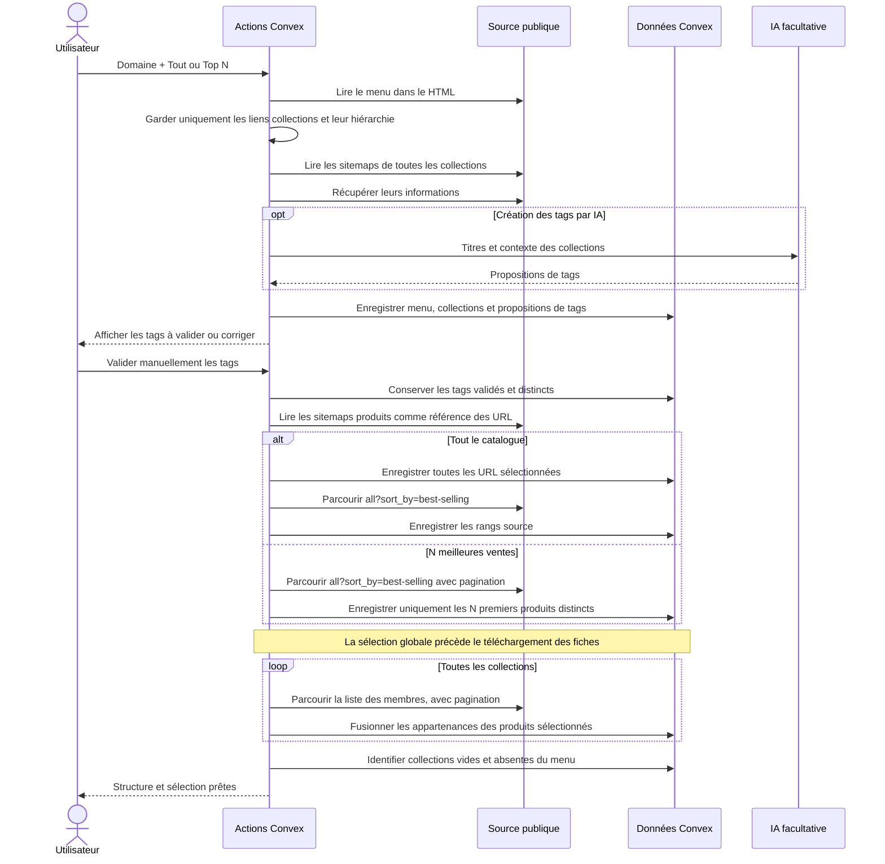
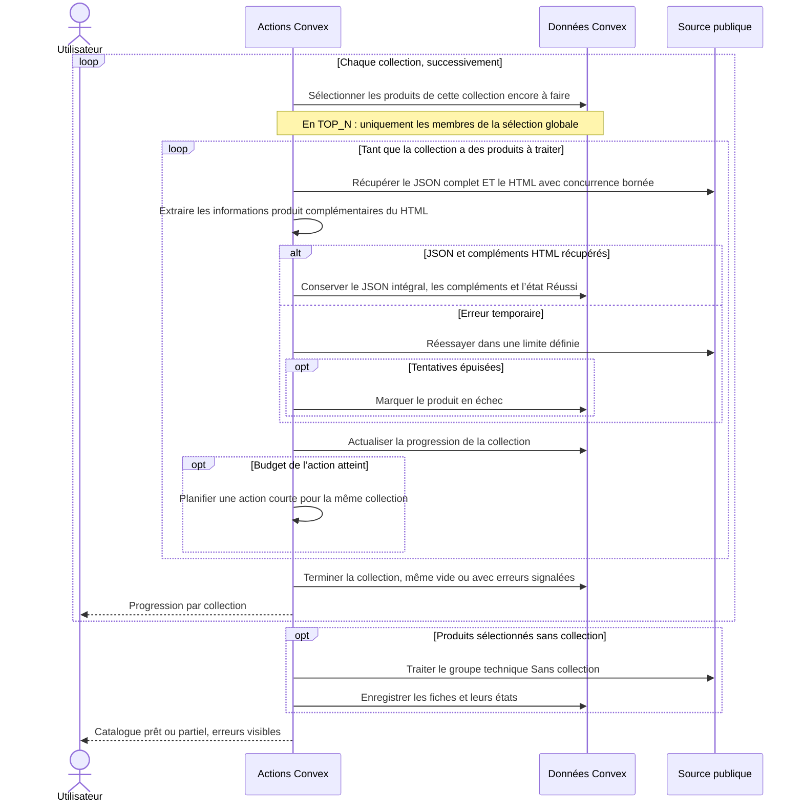
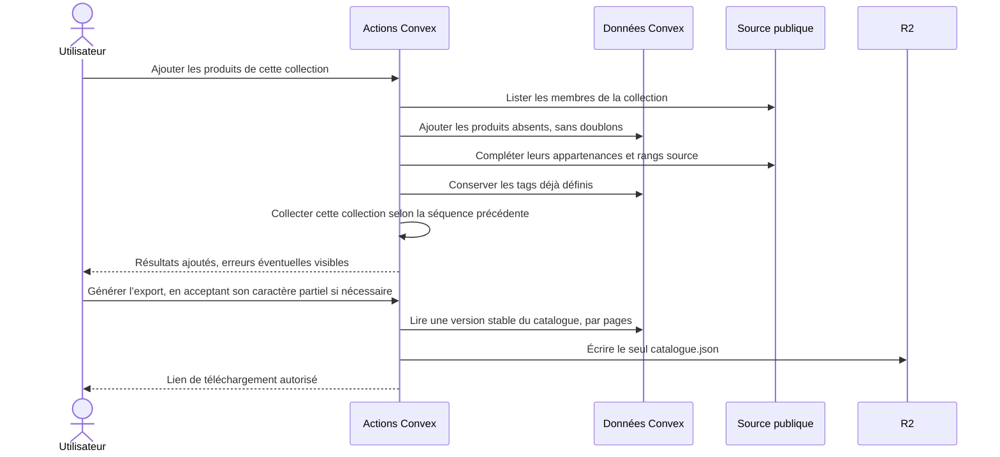
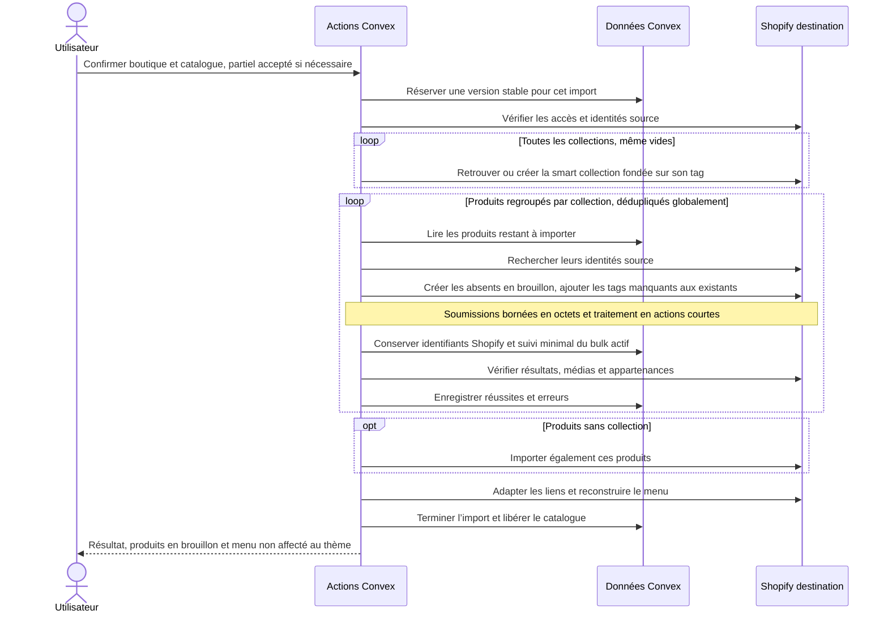
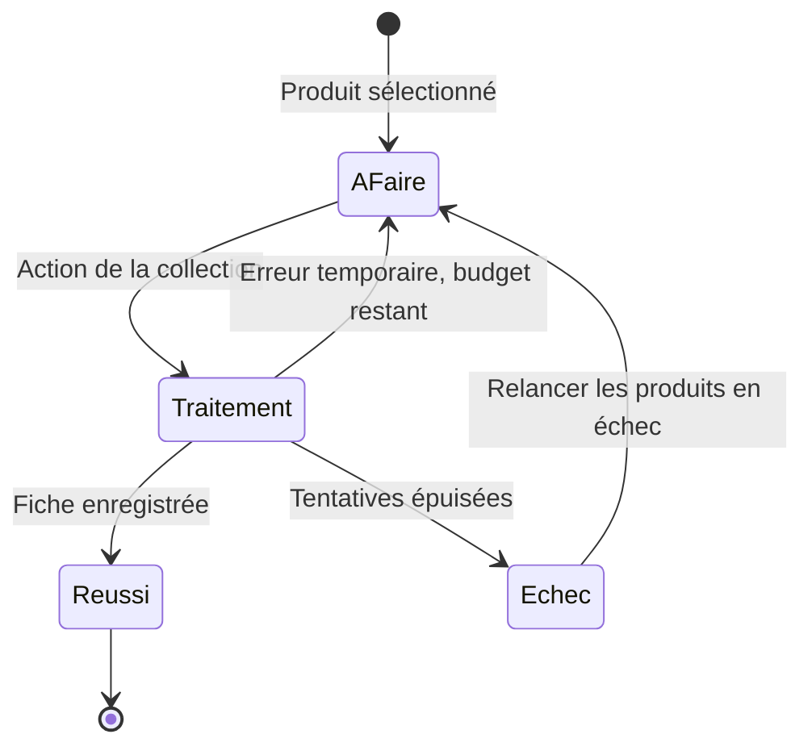

> Mise à jour du 1er octobre 2026 : implémentation autorisée dans la conversation suivante. « Reprendre là où ça a fail » remplace le redémarrage destructif ; « supprime tout » autorise le retrait des anciennes données catalogue **dev uniquement**. Voir [transition](catalog-workspace-migration.md) et [qualification](catalog-refonte-qualification.md). Le cadrage historique ci-dessous est conservé.

# Import / export Shopify — UML de la refonte

Date : 28 septembre 2026, actualisé le 29 septembre. Référence : [attendus utilisateur](catalog-refonte-attendus.md).

Cadrage frontend : [parcours et maquette V2](catalog-refonte-interface.md), image fournie par l’utilisateur le 30 septembre 2026. La maquette illustre l’espace catalogue ; les séquences ci-dessous restent le contrat de fonctionnement.

Architecture acceptée : Convex, conservation des produits réussis, travail collection par collection à taille variable, un fichier R2 final. Ce document remplace la proposition de worker longue durée et d’abandon systématique de toutes les données après échec. Il décrit la cible, pas le moteur actuellement déployé.

## 1. Stockage et exécution

| Emplacement | Contenu |
| --- | --- |
| Convex `catalogues` | Propriétaire, source, mode, N, menu, collections avec tags, état de chaque collection et coordination du travail |
| Convex `produits` | Une fiche par identité et catalogue : URL, appartenances, rang source, état, JSON source intégral, compléments HTML et résultat d’import utile |
| R2 | Un seul `catalogues/{id}/catalogue.json`, généré à la demande |

Les tables existantes d’authentification et de boutiques sont réutilisées. Aucun fichier par produit, aucune source brute, aucun checkpoint ou journal intermédiaire dans R2. Les images restent des URL source.

Le JSON source intégral fait partie de la fiche Convex et de l’export final. Les champs inconnus sont conservés. Le HTML est lu systématiquement pour extraire les informations produit complémentaires (sections, caractéristiques, dimensions, matière, entretien, etc. lorsqu’elles sont présentes), avec leur provenance. La page HTML complète n’est pas archivée dans un fichier supplémentaire. Un JSON réussi avec un HTML en échec ne constitue pas une fiche complète.

Convex est la source de vérité ; le fichier R2 est un export dérivé. Les modifications du catalogue invalident l’export précédent jusqu’à sa régénération. Une seule opération modifiant un catalogue est active à la fois. Un import utilise une version figée : édition et ajout attendent sa fin. Les métadonnées de version, de travail actif et d’opération Shopify en cours évitent les exécutions concurrentes et les soumissions ambiguës ; elles ne dupliquent pas les produits sous forme de checkpoints R2.

**Une collection = un lot métier, de taille variable.** Ses produits sont traités par actions Convex courtes, avec une concurrence HTTP bornée. Une grosse collection peut demander plusieurs actions sans être présentée comme plusieurs lots. La durée, le volume de données et les budgets réseau bornent chaque action, pas une taille métier arbitraire de 25 produits. On passe à la collection suivante lorsque tous ses produits sélectionnés sont réussis ou en échec après les tentatives autorisées.

Le menu et les collections embarqués dans le document catalogue doivent respecter les limites de taille Convex ; valider ces bornes explicitement. La découverte et la pagination s’exécutent elles aussi en actions bornées. Le suivi minimal stocké dans Convex permet de continuer : la politique « aucun état persistant » a été remplacée par l’accord de conserver les résultats et leur état.

## 2. Classes

`Catalogue` et `Produit` correspondent aux deux tables métier. Menu, collections, variantes et images sont des valeurs imbriquées, pas des tables supplémentaires. Les champs représentent les relations principales, pas encore un schéma TypeScript définitif.

La relation produit–collection est conservée une seule fois sur le produit. Les tags attribués se déduisent des collections ; les tags manuels restent préservés. `limiteN` est facultatif en mode TOUT. Un rang absent n’est jamais inventé. Les données normalisées servent à l’affichage et à l’import, sans remplacer ni réduire le JSON source intégral. Les seules destinations cliquables du menu sont des collections ; un parent structurel peut rester un libellé sans lien.

## 3. Composants

Pas de worker longue durée à héberger. Réutiliser HTTP, les parseurs XML/HTML et les outils existants ; navigateur seulement si le contenu nécessaire dépend de JavaScript. L’IA propose les tags des collections ; l’utilisateur les valide ou les corrige et les collisions sont contrôlées avant validation. Les appartenances observées déterminent l’attribution aux produits. Aucun tag proposé n’est appliqué automatiquement sans cette validation.

## 4. Séquence — découverte et sélection

Le sitemap fournit des URL, pas les appartenances ni le classement. Les listes des collections sont donc nécessaires même en TOP_N, sans télécharger les fiches hors sélection. Le parcours peut utiliser `/collections/{handle}?sort_by=best-selling` avec sa pagination lorsque ce tri est disponible. Le classement global de la sélection vient de `/collections/all?sort_by=best-selling`. Consolider les URL normalisées et les identités source, jamais les titres. N s’applique à la boutique entière, pas à chaque collection. Si la liste s’arrête avant N, signaler le nombre réellement disponible. Ne pas substituer silencieusement l’ordre du sitemap à un classement best-selling inaccessible. Les incohérences de couverture entre sitemap et collections restent signalées.

Le menu ne contient plus de destinations vers des pages, articles, produits ou liens externes. Proposition : conserver un parent non-collection uniquement comme libellé sans lien s’il contient des descendants collections, puis retirer les branches vides. La représentation de ces libellés dans l’API de menu Shopify devra être validée sans réintroduire leur ancienne URL hors périmètre.

## 5. Séquence — collecte collection par collection

Un produit commun à plusieurs collections est téléchargé une seule fois et conserve tous ses tags. Sa réussite est globale au catalogue. Ses échecs ne déclenchent pas une nouvelle série de tentatives à chaque collection : seul le budget prévu ou une relance explicite le permet. Le groupe « Sans collection » ne crée aucune collection Shopify artificielle. Le rang best-seller est indépendant de l’ordre de traitement.

Une action arrêtée peut être rejouée : elle ignore les fiches réussies et écrit les autres sous leur identité stable. Le contrôle du travail actif empêche une ancienne action d’écrire après annulation ou redémarrage. Aucun fichier de checkpoint n’est nécessaire.

## 6. Ajout manuel et export

L’ajout peut porter le nombre de produits au-delà de N. Un échec ne supprime pas les réussites. Une modification rend le fichier exporté précédent obsolète ; la régénération remplace la même clé R2. Un échec d’export ne supprime pas le catalogue Convex : seule la génération du fichier est à relancer. Les uploads incomplets doivent être abandonnés, sans laisser de fichiers intermédiaires permanents. Si des produits restent en échec, signaler le caractère partiel et demander son acceptation avant export/import.

## 7. Séquence — import Shopify

Une collection n’impose pas un unique fichier bulk : les limites Shopify et le plafond en octets peuvent exiger plusieurs soumissions. Les produits partagés ne sont pas créés plusieurs fois. Une relance retrouve les objets par identité stable et conserve les tags manuels. Un bulk à réponse incertaine est réconcilié avant toute nouvelle soumission ; ne pas le relancer aveuglément. Le suivi minimal est dans Convex, sans journaux R2 par lot.

Le menu importé ne contient que des liens collections et les regroupements structurels nécessaires. Les collections vides restent des destinations valides. Le classement source est conservé pour l’interface/export ; le tri best-selling de destination dépend de ses propres ventes. L’export conserve le JSON source complet ; l’import transforme les seuls champs inscriptibles dans Shopify et les compléments HTML pertinents. Il ne recopie pas les identifiants source comme identifiants de destination.

## 8. États d’un produit et politique d’échec

`Traitement` représente l’exécution, pas obligatoirement un état persistant par produit. Le catalogue coordonne l’action active. Les états enregistrés minimaux sont A_FAIRE, REUSSI et ECHEC.

- Une erreur produit ne supprime aucune fiche réussie.
- Une erreur globale de découverte empêche de déclarer le catalogue complet ; relancer la phase concernée en fusionnant les données sans doublons.
- « Tout recommencer » est une action explicite : arrêter/invalider le travail courant, nettoyer les données de ce catalogue puis lancer une collecte neuve. Cela ne supprime pas les objets déjà présents dans Shopify.
- Aucun nettoyage automatique des réussites après une erreur réseau.

## 9. Paramètres proposés et contrôles avant implémentation

Valeurs de départ proposées, non qualifiées sur la refonte :

- Au plus quatre requêtes source simultanées, départs initialement espacés de 450 ms par domaine ; ralentissement après 429/503 et respect de `Retry-After`.
- Timeout de 30 secondes par requête, trois tentatives au total pour les erreurs temporaires. Un 403/challenge interrompt la collecte concernée. Les contrôles réseau et d’accès existants restent obligatoires.
- Actions visant environ 60 secondes de travail utile, arrêt des nouveaux départs au budget atteint et attente des requêtes déjà lancées avant continuation. La collection reste le lot métier variable ; le budget ne supprime aucun produit.
- Identités et URL normalisées pour déduplication ; contrôles de boucle, de page répétée et de pagination interrompue, plutôt que déclarer la collection complète après une page vide inattendue.
- Le nombre réel disponible et la date de lecture accompagnent le classement source. Les ventes ne sont pas connues et la source peut changer entre deux pages.

Contrôles et état de qualification : voir le [relevé réel du 29 septembre](catalog-refonte-verification-prealable.md). Pagination best-selling complète validée sur 964 produits ; trois collections et cinq fiches contrôlées. **115 collections sont découvertes par sitemap, dont 41 hors menu principal**. Les contrôles ci-dessous restent à généraliser au-delà de cet échantillon :

1. Vérifier les sitemaps, les listes paginées et le tri best-selling sur la source pilote ; comparer identités uniques et couverture.
2. Inventorier les compléments HTML présents sur des fiches représentatives, dont les contenus dynamiques. Ne pas traiter le HTML comme facultatif ni les JSON seuls comme une collecte complète.
3. Mesurer la taille du JSON intégral et des compléments pour respecter les limites des documents et mutations Convex. Aucun champ ne sera supprimé pour rentrer artificiellement dans une limite ; si une fiche dépasse la capacité du modèle à deux tables, elle doit être signalée et le stockage réévalué avant implémentation. Aucun nouveau fichier R2 par produit n’est décidé implicitement.
4. Vérifier la représentation des parents de menu sans lien collection ; ne pas inventer une destination.
5. Préparer une transition isolée depuis le moteur existant, sans écraser ses catalogues ou imports.

La reproduction visuelle de l’ordre source sur la boutique cible n’est pas ajoutée au périmètre : seul le classement consultable/exporté est prévu à ce stade.

L’architecture validée n’exige plus de worker longue durée ni de stockage de checkpoints dans R2. Les mécanismes existants restent inchangés tant que la refonte n’est pas implémentée et vérifiée.
