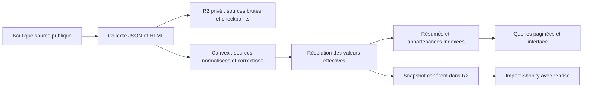

# Import de catalogue — contexte technique pour une prochaine IA

Document de reprise, établi à partir du code et des validations du 25 septembre 2026. Il décrit l’implémentation présente dans le dépôt, pas seulement l’architecture envisagée. Vérifier le diff Git et l’état réel du déploiement avant de poursuivre : les changements peuvent encore être non commités et les données peuvent avoir évolué.

## 1. Fonction et objectif de la refonte

Le module `/catalog-import` collecte une boutique publique Shopify, permet de préparer et corriger son catalogue, produit un export JSON privé, puis peut importer une sélection dans une boutique connectée. L’espace catalogue comporte la structure (collections et menu), les produits, les erreurs et l’activité.

Avant la refonte, Convex coordonnait les opérations mais les fiches, résumés et corrections étaient dans R2. Construire une liste impliquait de lire la préparation, scanner des résumés, puis ouvrir des fiches complètes. Les filtres sélectifs nécessitaient des centaines de GET et pouvaient produire des pages vides avec continuation.

La refonte fait de **Convex le stockage du catalogue de travail**. **R2 conserve les sources brutes, les checkpoints et les snapshots d’export/import**. Le cache navigateur accélère les retours de navigation ; les premières lectures sont elles-mêmes indexées et ne dépendent plus de scans R2.

Ce chantier ne change pas les règles métier SEO, la langue des contenus, le scraper ou le moteur Shopify sans nécessité. Il n’ajoute ni Redis, ni service de recherche externe, ni nouveau service payant.

## 2. Documents complémentaires

| Document | À utiliser pour |
| --- | --- |
| [catalog-import.md](catalog-import.md) | Parcours utilisateur, configuration, collecte et garanties Shopify |
| [catalog-workspace-migration.md](catalog-workspace-migration.md) | Commandes exactes, dry-run, reprise, publication et rollback |
| [catalog-workspace-qualification.md](catalog-workspace-qualification.md) | Résultats mesurés, tests réalisés et limites de qualification |
| [Plan initial](../.agents/prompts/PLAN-CATALOGUE-PERFORMANCE-ET-REFONTE.md) | Intentions et critères d’acceptation ; certaines hypothèses y décrivent l’ancien système |

Le plan initial ne remplace pas la lecture du code actuel. Aucun document ni identifiant de déploiement ci-dessous ne vaut autorisation de production.

## 3. Répartition des responsabilités



L’identité du propriétaire est obtenue côté serveur. Les points d’entrée publics utilisent `requireUserId` et `ownedOperation` ; les contrôles de boutique de destination restent dans le parcours d’import. Les paramètres `owner` de fonctions internes ne constituent pas une API publique d’usurpation d’identité.

La racine R2 effective est `catalogOperations.root`. Ne jamais la reconstruire en supposant qu’elle correspond à l’identifiant actuel de l’opération : des catalogues ont été transférés et les fixtures ont une racine distincte.

## 4. Modèle de données Convex

Les tables sont définies dans [schema.ts](../convex/schema.ts).

| Table | Contenu et usage |
| --- | --- |
| `catalogOperations` | Propriétaire, origine, type export/import, statut, phase, compteurs, révision, génération, tâche active, baux, racine R2, mode de stockage et snapshot |
| `catalogTasks` | Tâches reprenables, état, tentatives, génération et références de checkpoints/résultats |
| `catalogDomainLeases` | Coordination des traitements sur un même domaine |
| `catalogWorkspaces` | Préparation active, versions des vues, recalcul en attente, checkpoint de migration, empreinte source, version des données et dernier rejeu d’édition |
| `catalogSources` | Une identité source par catalogue, handle canonique, corrections `override` séparées, empreinte et nombre de fragments |
| `catalogBodies` | JSON de la fiche source normalisée, fragmenté ; descriptions, variantes, médias, erreurs et champs inconnus sont conservés |
| `catalogRows` | Résumé de liste par catalogue/version/handle, sans description ni variantes complètes |
| `catalogPostings` | Entrées matérialisées pour collection, filtres et recherche ; chaque entrée référence un résumé |

Les corps et corrections sont sérialisés en JSON. Cette représentation conserve les champs source inconnus ; ne pas la remplacer par une sélection partielle de propriétés sans migration démontrant leur conservation.

Les variantes et médias restent dans le corps fragmenté : ils ne sont pas chacun une table autonome. Les tailles mesurées du pilote sont petites (maximum 7 103 octets par fiche source), et les listes n’ouvrent pas ces corps.

Les index principaux portent sur catalogue + handle, catalogue + identité, source + fragment, catalogue + version + handle, et catalogue + version + scope + longueur minimale de recherche + tri. Les upserts transactionnels contrôlent l’unicité ; un index Convex n’impose pas une contrainte d’unicité à lui seul.

L’identité est le domaine normalisé + identifiant Shopify source lorsque disponible, sinon une identité provisoire fondée sur l’URL. La collecte rapproche les alias via cette identité et conserve le handle canonique. La migration refuse une identité ambiguë plutôt que de fusionner arbitrairement. Ne jamais dédupliquer par titre ou SKU.

## 5. Modes, versions et états : ne pas les confondre

| Champ | Signification |
| --- | --- |
| `catalogOperations.storageMode` absent | Lecture/édition legacy dans R2 |
| `storageMode = migration` | Lecture legacy disponible ; écritures métier bloquées pendant le backfill |
| `storageMode = convex` | Convex est le catalogue de travail ; lectures et éditions y sont dirigées |
| `catalogWorkspaces.mode` | `migration`, `active` ou `legacy` après retour arrière |
| `catalogOperations.revision` | Révision utilisée pour les conflits d’édition et l’assemblage ; plusieurs opérations métier l’incrémentent |
| `catalogOperations.generation` | Génération d’exécution permettant de rejeter les anciens workers |
| `activeVersion` / `pendingVersion` | Version visible des résumés/index et version de recalcul en construction |
| `dataVersion` | Invalidation logique des curseurs quand les données matérialisées évoluent |
| `snapshotRevision` | Verrou d’assemblage cohérent ; reste présent pendant une pause |
| `stage` | `copy`, `validate`, `ready` pour la migration ; `rebuild` pour un recalcul |

`count` et `validated` du workspace servent à la migration/reconstruction. Ne pas les traiter comme des compteurs commerciaux toujours synchronisés pendant toute collecte : les compteurs d’opération ont leur propre cycle.

Les nouveaux exports utilisent Convex ; `initialize` crée leur workspace après la découverte initiale de structure. Les anciens exports restent compatibles sans migration automatique.

## 6. Résolution métier commune

[workspaceModel.ts](../convex/catalogImport/workspaceModel.ts) contient `resolveWorkspace`, qui appelle `prepareProduct` et `matchesCollection` de [model.ts](../convex/catalogImport/model.ts). Cette résolution alimente le résumé, les appartenances cibles, le détail et le snapshot.

- `product.collections` représente les appartenances **source**, pas la liste des collections cibles calculées.
- Sans correction manuelle, les tags proviennent des collections source sélectionnées et approuvées auxquelles appartient le produit.
- `override.tags` **remplace** ces tags hérités ; ce n’est pas une union.
- Les tags effectifs sont nettoyés, normalisés en NFC, dédupliqués et triés. Ils ne sont ni traduits ni régénérés pendant une migration.
- Les règles cibles comparent les tags par conditions ET (`all`) ou OU (`any`). Une règle sans tag ne correspond à aucun produit.
- `minSizeCm` ajoute un avertissement ; ce n’est pas un filtre strict d’exclusion de collection.
- Le filtre erreurs correspond à `product.errors.length > 0`. Le filtre « à vérifier » correspond à un produit non marqué `reviewed` présentant erreurs ou avertissements.
- `excluded` et `reviewed` restent des corrections distinctes. Ne pas retirer silencieusement les exclus de toutes les listes de travail.

La migration compare aussi les anciens résumés et le filtrage legacy. Un résumé périmé ou une normalisation qui changerait une appartenance bloque la migration avec une erreur explicite ; ce n’est pas l’occasion de reclasser silencieusement les produits.

## 7. Lecture, filtres et recherche

Les queries publiques `catalogWorkspace.products`, `product`, `structure` et `state` vérifient l’accès au catalogue. `products` renvoie un JSON de résumés, un curseur, le nombre d’entrées examinées et un indicateur `reset`. `product` charge un seul corps et applique les corrections. `structure` renvoie la préparation avec la révision courante de l’opération.

Une page de produits contient au plus 50 résumés. Les appartenances et combinaisons de filtres sont matérialisées en amont dans `catalogPostings`. La query lit au plus 51 postings correspondants (le dernier annonce une page suivante), puis au plus 50 résumés, en plus des documents de contrôle. Elle n’ouvre aucun corps produit et n’effectue aucun GET/LIST R2.

Le `scope` sérialise `[collection, onlyErrors, onlyIssues]`. Une clé de collection inconnue conserve le comportement legacy : retour au scope global. Une collection connue mais vide produit une page vide définitive, sans scanner le catalogue.

La recherche conserve exactement la correspondance `title.toLowerCase().includes(search.toLowerCase())`. Elle porte sur le **titre effectif**. Elle ne supprime pas les accents, ne tokenize pas les mots et ne doit pas être remplacée silencieusement par une recherche plein texte Convex.

L’index utilise des suffixes du titre encodés en unités UTF-16 hexadécimales. `searchEntries` calcule, pour chaque suffixe utile, la longueur minimale de préfixe qui le distingue des occurrences précédentes. La query parcourt les partitions admissibles : une sous-chaîne répétée dans un titre ne produit qu’un résultat par produit. Les suffixes entièrement redondants sont omis.

Sans recherche, le tri suit le handle encodé, comme les clés legacy R2. Avec recherche, le tri suit la longueur minimale de préfixe, le suffixe puis le handle : **ce n’est pas l’ancien ordre de scan ni un classement de pertinence**. Le contrat conserve les correspondances, avec cet ordre explicitement documenté.

Le curseur lie catalogue, version active, `dataVersion`, scope et texte. Un curseur incompatible revient à la première page avec `reset = true` ; l’interface doit aussi réinitialiser la présentation de sa pagination.

## 8. Édition et recalcul des règles

L’interface conserve les actions publiques `catalogImportActions.saveProduct` et `saveStructure`, qui valident les entrées, vérifient le propriétaire et choisissent le chemin legacy ou Convex.

Pour un produit migré, `catalogWorkspace.saveProduct` applique dans **une même mutation** la correction, le résumé et les postings. La révision attendue détecte les conflits. L’empreinte déterministe de la requête permet le rejeu immédiat d’une réponse perdue sans doubler la révision. Le workspace ne conserve pas un journal illimité de toutes les requêtes : après une autre édition, une ancienne révision doit être rejetée.

Pour la structure, `saveStructure` enregistre `pendingPreparation` et `pendingVersion`, puis planifie `rebuild`. `rebuildBatch` avance d’un produit par mutation, crée la nouvelle vue et garde l’ancienne visible. À la fin, préparation et pointeur actif basculent ensemble ; les anciennes vues sont supprimées par `pruneVersion`, par lots bornés. Ce nettoyage touche les données dérivées Convex, pas les sources ni les archives R2.

Les éditions et nouvelles collectes sont bloquées pendant migration/recalcul. Un échec du recalcul est enregistré dans `error` et peut être relancé via `retryClassification`. Ne pas publier une version partiellement reconstruite ou effacer le verrou pour contourner un échec.

## 9. Collecte, checkpoints et workers

[pipeline.ts](../convex/catalogImport/pipeline.ts) conserve le pipeline existant et reçoit un adaptateur facultatif `WorkspaceIO`. [catalogImportActions.ts](../convex/catalogImportActions.ts) fournit cet adaptateur pour les catalogues Convex : préparation, recherche du produit précédent, métadonnées de collection, écriture du produit et pages de snapshot.

La collecte écrit les réponses brutes et le checkpoint produit dans R2, puis matérialise le produit dans Convex. Le checkpoint inclut les deltas de compteurs et la fiche : si la réponse de mutation est perdue, le même résultat est rejoué. Les corrections existantes restent séparées et sont conservées lors d’une relance. Il n’y a pas de seconde copie éditable dans `products/` et `summaries/` R2 pour le chemin migré.

Il n’existe pas de transaction distribuée R2/Convex. La cohérence repose sur les checkpoints, l’idempotence, `activeTaskId`, la génération et les écritures R2 conditionnelles par ETag. Préserver ces contrôles dans toute évolution. Les baux et le watchdog restent ceux du pipeline existant ; ne pas les raccourcir pour accélérer l’affichage.

La migration ne suit jamais ce chemin de collecte : elle ne lance ni scraping, ni IA, ni import Shopify.

## 10. Snapshot et import Shopify

`finalize` vérifie les compteurs et l’acceptation explicite d’un export partiel, puis planifie l’assemblage. Celui-ci verrouille une révision et lit les fiches Convex par pages de cinq via `snapshotPage`, avec vérification de la génération et de la tâche active. Le pipeline écrit les fiches et le JSON final dans `final/{revision}/` via le multipart R2 existant.

Une pause ne libère pas le verrou éditorial du snapshot : il faut le reprendre pour éviter un export mêlant plusieurs états. Les corrections ultérieures invalident le pointeur d’export courant, mais ne modifient pas les anciens objets de snapshot.

L’identité produit Shopify `imagen_catalog.source_id` doit avoir une définition `PRODUCT` de type `id`. Le payload `productInput.metafields` transmet uniquement `{ namespace, key, value }`, exactement comme `identifier.customId` ; le type est fourni par la définition. Une définition texte unique ne suffit pas aux API `customId` : ce défaut a été identifié lors d’un import réel après la qualification initiale. Le code refuse désormais une définition incompatible, sans suppression automatique. Le marqueur des collections reste un champ texte distinct par son propriétaire `COLLECTION`.

Après réparation de la définition Peluche, l’import a rencontré `METAFIELD_MISMATCH`. Les checkpoints R2 lus le 25 septembre montrent des valeurs identiques mais un champ supplémentaire `type: "id"` dans `input.metafields`. Le payload a été aligné sur le tuple minimal documenté par Shopify. `productSetVariables` valide les identités et normalise uniquement les lots non soumis avant upload ; les lots soumis ou incertains ne sont ni réécrits ni resoumis. Un test inspecte le vrai fichier JSONL transmis au mock d’upload. L’acceptation de ce correctif par un import Shopify réel reste à vérifier avec autorisation explicite ; les tests locaux ne prouvent pas le comportement serveur Shopify.

Un import capture `sourceSnapshot` et continue à lire ce snapshot immuable. Le moteur [shopify.ts](../convex/catalogImport/shopify.ts) garde ses garanties : identité distante stable, produits en brouillon, conservation des tags manuels existants, rapprochement des soumissions bulk incertaines, correspondances, menu distinct et rapports d’erreurs. Ne pas modifier le format du snapshot ou les identités sans adapter et tester ce consommateur.

## 11. Frontend et incident de boucle corrigé

[use-catalog-data.ts](../app/features/catalog-import/hooks/use-catalog-data.ts) sélectionne les actions legacy ou les queries Convex selon `storageMode`. [use-catalog-query.ts](../app/features/catalog-import/hooks/use-catalog-query.ts) gère l’abonnement, les erreurs/reprises, le cache et l’état de navigation.

Le cache est uniquement en mémoire : au plus 32 réponses, budget estimé de 8 Mo, réponse supérieure à 2 Mo non conservée, au plus 20 états de navigation. Ses clés incluent propriétaire, catalogue, révision, `updatedAt`, fonction et arguments selon le hook appelant. Aucun catalogue privé n’est persisté dans `localStorage`. Le composant monté détient son abonnement ; les collections quittées ne gardent pas d’abonnement permanent.

`AuthGate` réinitialise la session du cache dans un `useLayoutEffect`, avant les effets d’abonnement. Les réponses tardives d’une ancienne session ne repeuplent pas le cache. Les vues produits et erreurs conservent leur pagination et traitent `reset` sans présenter une ancienne page comme une nouvelle.

**Piège à ne pas réintroduire :** `api.catalogWorkspace.products` et les autres références générées sont des proxies dont l’identité JavaScript change à chaque accès. Le hook ne doit pas placer directement ce proxy dans les dépendances de son effet. Il utilise `getFunctionName(query)`, puis `makeFunctionReference(name)` à l’intérieur de l’effet. Les arguments sont stabilisés par sérialisation.

L’ancienne dépendance au proxy déclenchait une boucle abonnement → état → rendu → nouvel abonnement. Les logs dev ont montré 20 appels en 455 ms, tous servis depuis le cache. `cachedResult = true` et zéro lecture base ne prouvent donc pas l’absence de problème côté client. Un test navigateur avec React réel et client Convex simulé couvre désormais ce cas.

## 12. Migration et retour arrière

Le point d’entrée CLI est [catalog_workspace.mjs](../scripts/catalog_workspace.mjs), qui appelle l’action interne `catalogMigration.step`. Lire la [procédure complète](catalog-workspace-migration.md) avant toute exécution.

Le parcours est `dry-run` → `migrate` ou `resume` → contrôle `status` → `publish` explicite. `migrate` commence par `begin`, puis copie par lots de 25, avec lectures concurrentes bornées à cinq. Une seconde passe compare les empreintes SHA-256 canoniques source + correction, les valeurs effectives et les index matérialisés. Les checkpoints comparent phase et curseur attendus pour éviter une double progression.

La publication exige `count = validated = op.done + op.failed`, une préparation source inchangée et une migration `ready`. Les objets ou corrections manquants, sources divergentes et identités ambiguës bloquent la bascule. Les rapports `products` et `postings` comptent les traitements des deux passes ; le nombre de produits uniques vient de `checkpoint.count`.

Le rollback avant édition réactive le lecteur legacy sans supprimer les données. Il est refusé après édition/collecte ou changement de révision/génération, et pendant un recalcul. Un nouvel export change aussi la révision. **Aucun export inverse général Convex → ancien catalogue R2 n’a été implémenté** : après nouvelles éditions, privilégier une réparation en avant ; ne pas promettre un retour arrière sans perte.

## 13. État connu, limites et validations

Dernière qualification enregistrée, à recontrôler avant action :

| Cible | État documenté |
| --- | --- |
| Dev `curious-greyhound-437` | Catalogue `q17317nba9s76hgmxhdeydsbrx8ezbdg`, 964 produits dont 9 incomplets, 74 collections ; migration, interruption/reprise, rollback et remigration testés ; Convex actif, vues version 2 |
| Fixture dev | `q177kbtc61xzttgjbnn0fhfx4x8f35nv`, racine `catalog-rehearsals/...`, un produit pour éditions/règles/export ; ne pas la confondre avec le pilote |
| Prod `youthful-bandicoot-479` | Référence connue `q174qb3sh3z0gzrh7k970zhh8h8f0h8b` ; aucune migration ou modification de production autorisée/exécutée par cette refonte |

Lors du pilote, aucune des 74 collections n’était approuvée : les collections cibles vides étaient attendues. Ne pas approuver automatiquement des règles pour « réparer » une liste vide.

Limites applicatives actuelles : 3 500 postings par produit pour permettre leur remplacement atomique ; 1 024 groupes de recherche ; résumé ≤64 000 octets ; corps ≤64 fragments de 100 000 caractères sans couper de paire UTF-16 ; structure ≤300 Ko et 500 collections. Les limites de lecture/écriture de la plateforme s’appliquent aussi. Les règles très larges et les fiches beaucoup plus lourdes que le pilote demandent une nouvelle qualification, pas une suppression arbitraire des contrôles.

Les mesures serveur sur trois appels par scénario montrent une médiane « Tous les produits » de 9 208 → 28 ms, recherche de 13 606 → 151 ms, erreurs de 6 974 → 196 ms ; zéro GET/LIST R2 après bascule. Ce ne sont ni un p95 fiable ni des temps de rendu navigateur. Le benchmark 1 000/10 000 produits utilise `convex-test` en mémoire, pas le réseau.

La qualification comprend 268 tests réussis, un benchmark synthétique séparé, TypeScript, build et contrat public Convex. L’édition, le rejeu, les conflits, le recalcul et l’égalité snapshot/détail ont aussi été testés sur une fixture dev réelle. Le snapshot reste inchangé après une nouvelle correction.

**Restent non qualifiés dans cette passation :** le parcours visuel complet avec une session utilisateur authentifiée, les temps de rendu/retour en cache sur ce parcours, et un import Shopify réel sur boutique de développement. Le test isolé des abonnements passe, mais ne remplace pas ces validations. La correction frontend de la boucle n’est pas un déploiement en production.

## 14. Reprendre le travail efficacement

Lire d’abord `AGENTS.md`, ce document, puis les fichiers concernés. Pour le backend, lire `convex/_generated/ai/guidelines.md` et appliquer les skills Convex pertinents ; pour l’interface, appliquer Impeccable. Vérifier la version installée de Convex : lors de l’implémentation, elle était 1.39.1 alors que les guidelines générées visaient une version plus récente. Ne pas supposer qu’une API citée y est disponible.

| Changement envisagé | Points à examiner et à tester |
| --- | --- |
| Nouveau champ éditable | Validateur public, `override`, résolution, résumé si nécessaire, index et export |
| Règle d’appartenance | Résolution commune, migration legacy, reconstruction versionnée, rendu et snapshot |
| Recherche/pagination | `searchEntries`, `products`, curseurs, répétitions Unicode, combinaisons de filtres |
| Collecte/reprise | `WorkspaceIO`, checkpoints R2, `collected`, identité canonique, deltas et workers périmés |
| Cache/abonnements | Identité stable de fonction, arguments, session, nettoyage et test navigateur |
| Migration | Double exécution, interruption, source modifiée, corrections absentes, validation et limites du rollback |
| Format d’export | Assembleur, snapshots immuables et consommateur Shopify existant |

Commandes locales sans déploiement :

```sh
rtk npm test
rtk npm run typecheck
rtk npm run lint
rtk npm run build
rtk npm run check:convex-contract
rtk proxy env CATALOG_BENCHMARK=1 npx vitest run convex/catalogImport/workspace.bench.test.ts
```

Les tests spécifiques sont dans `convex/catalogImport/workspace.test.ts`, `migration.test.ts`, `workspace.bench.test.ts` et `pipeline.test.ts`, avec les tests existants du module pour Shopify et la collecte.

Pour le test React isolé, lancer `rtk proxy npx vite --config scripts/vite.catalog-query.config.ts`, ouvrir `http://127.0.0.1:3001/scripts/catalog_query_check.html`, vérifier les cinq `PASS`, puis arrêter ce serveur. Il utilise un faux client, sans accès au catalogue ni contournement de l’authentification.

`npx convex dev --once` pousse réellement le backend ; ce n’est pas un simple contrôle local. Identifier et annoncer la cible avant de l’exécuter. Une autorisation passée de transfert dev → prod n’est pas réutilisable. Aucun déploiement, changement de données en production ou import Shopify réel sans autorisation explicite correspondant à l’action.

Après une évolution, mettre à jour ce contexte si les contrats changent, la procédure si l’exploitation change et le rapport de qualification seulement avec les nouvelles preuves réellement obtenues.
